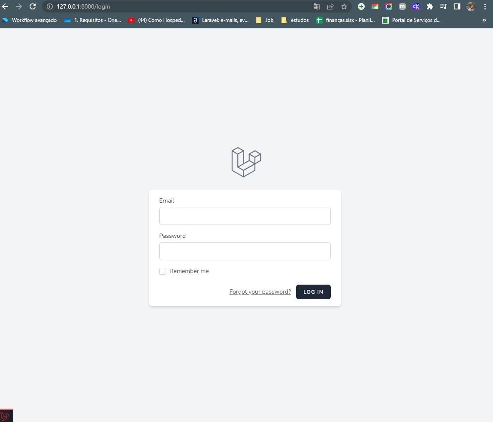
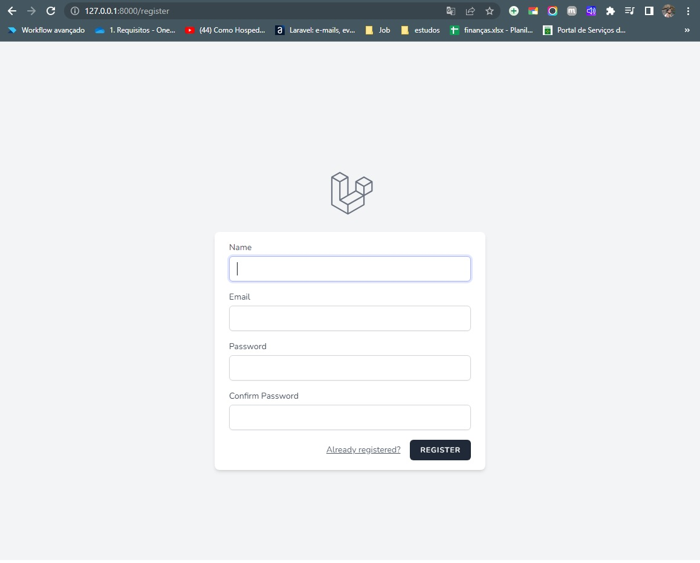
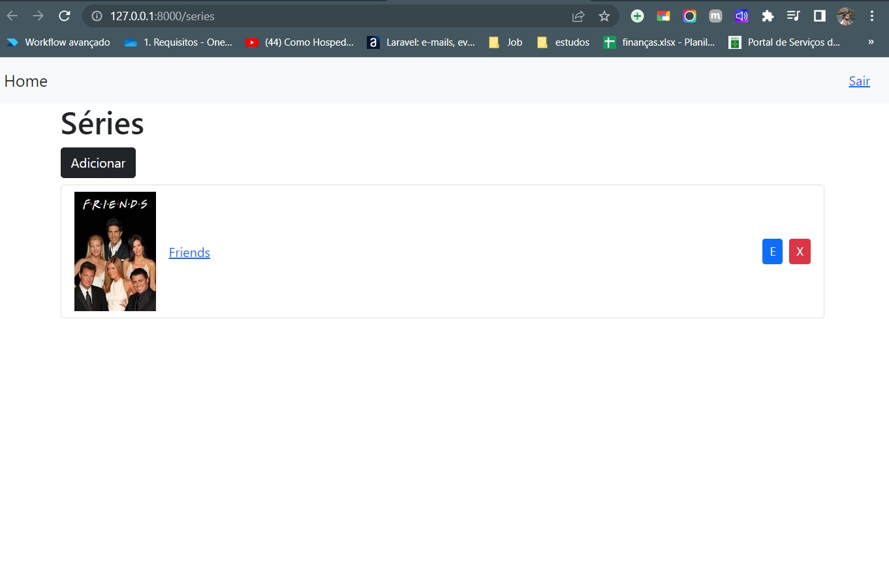
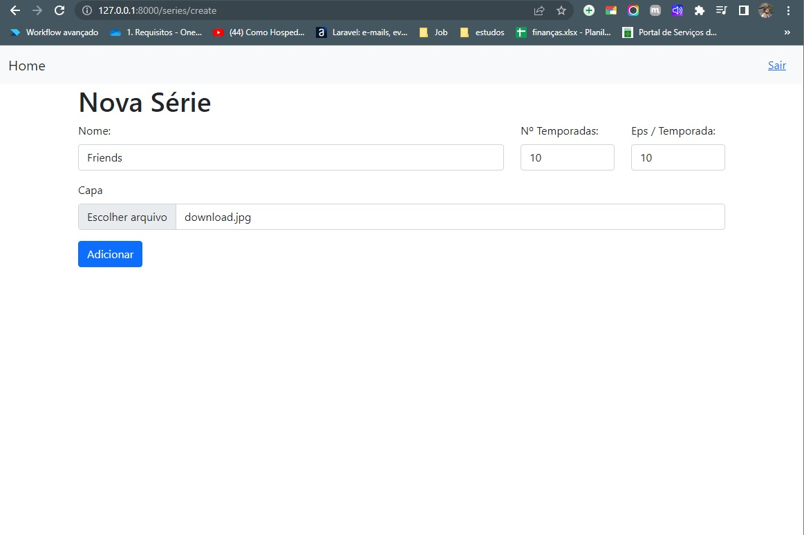
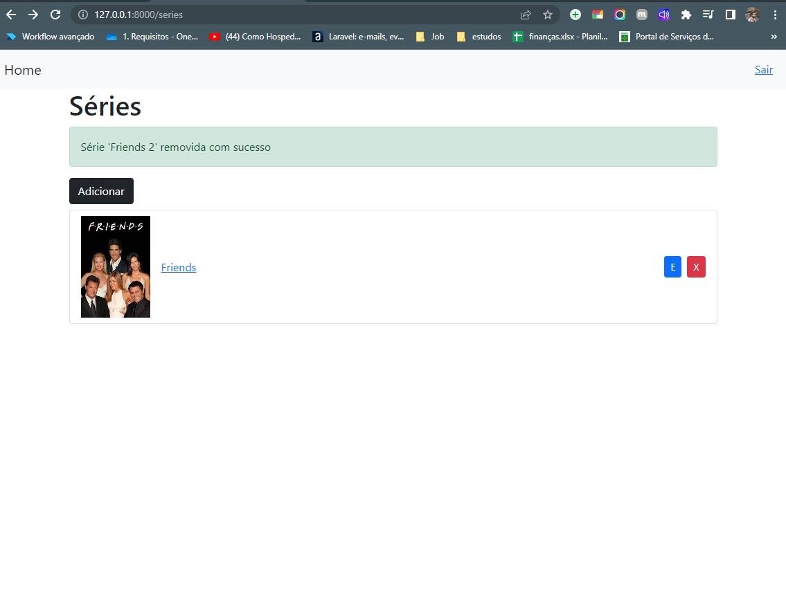
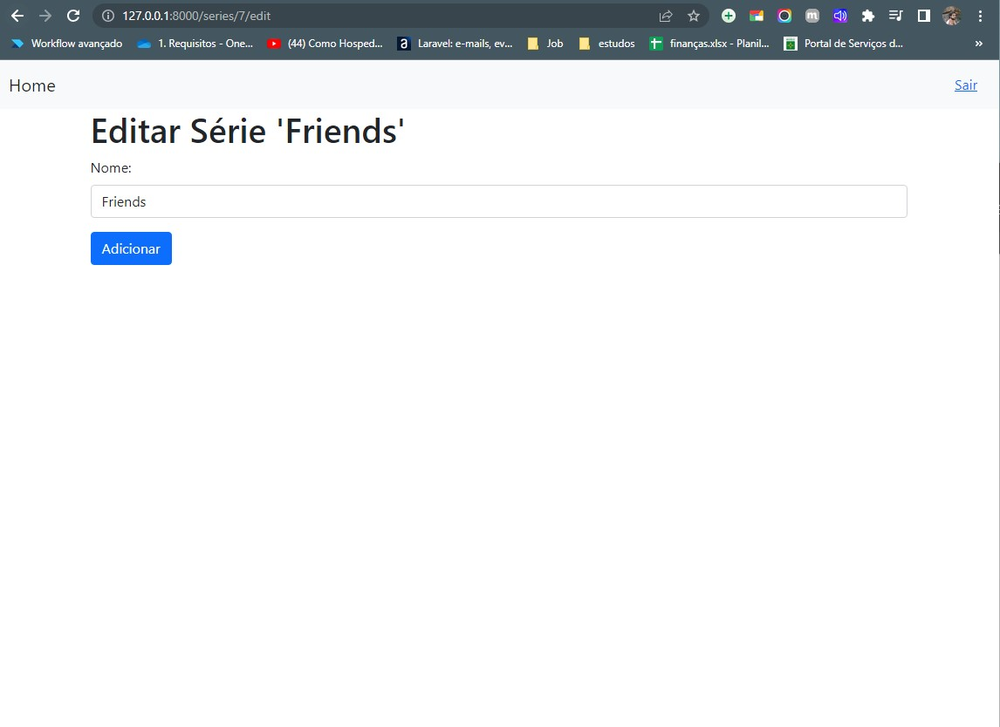
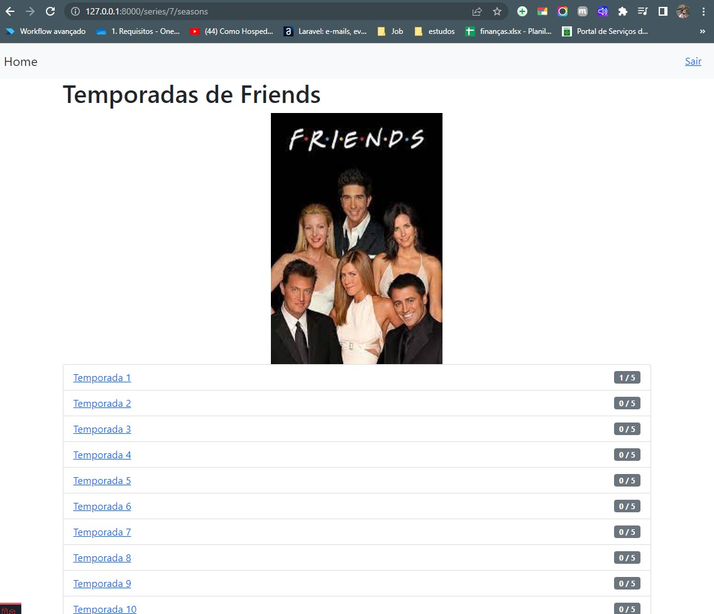
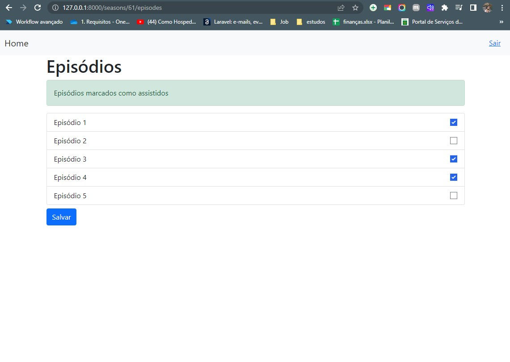

# Controle de Episódios 

# Sobre o projeto

https://wmazoni-sds1.netlify.app

Big Game Survey é uma aplicação full stack web e mobile construída durante a 1ª edição da **Semana DevSuperior** (#sds1), evento organizado pela [DevSuperior](https://devsuperior.com "Site da DevSuperior").

A aplicação consiste em uma pesquisa de preferência de games, onde os dados são coletados no app mobile, e depois são listados no app web, que também apresenta um dashboard com gráficos baseados nestes dados.

## Layout 
## Login
 

## Registro de novo login


## Home


## Adionar série


## Remover 


## Editar 


## Detalhes 


## Episódios 



# Tecnologias utilizadas
## Back end
- PHP
- 
## Front end
- HTML / CSS / TypeScript

- Banco de dados: Postgresql

# Como executar o projeto

 

```bash
# clonar repositório
git clone https://github.com/devsuperior/sds1-wmazoni

# entrar na pasta do projeto back end
cd backend

# executar o projeto
./mvnw spring-boot:run
```

## Front end web
Pré-requisitos: npm / yarn

```bash
# clonar repositório
git clone https://github.com/devsuperior/sds1-wmazoni

# entrar na pasta do projeto front end web
cd front-web

# instalar dependências
yarn install

# executar o projeto
yarn start
```

# Autor

Wellington Mazoni de Andrade

https://www.linkedin.com/in/wmazoni
